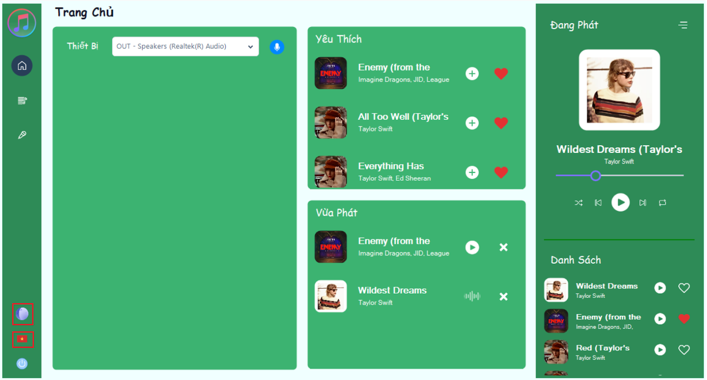
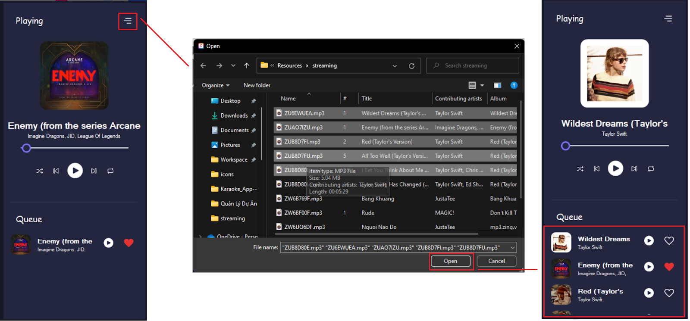
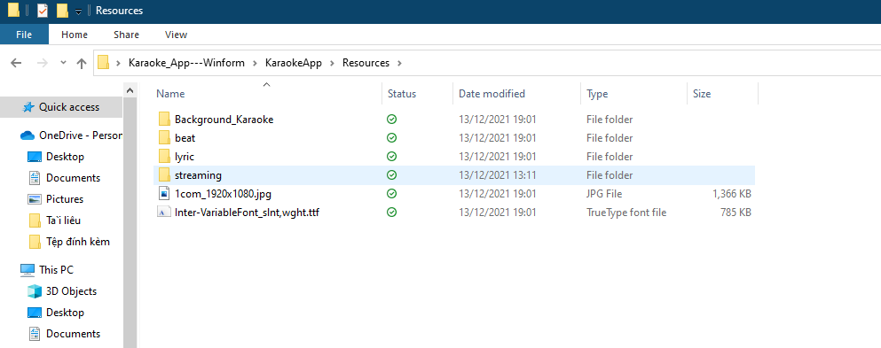

# Phần mềm nghe nhạc tích hợp tính năng nhận diện nhạc qua giai điệu

> Phần mềm là sản phẩm đồ án môn CS511.M11

> 

## Tính năng

- Nghe nhạc
- Tra cứu bài hát theo giai điệu
- Karaoke
- Phát nhạc kèm theo lời

## Yêu cầu hệ thống

- Hệ quản trị cơ sở dữ liệu: [MongoDB](https://mongodb.com/)
- (Optional) Đây là một số bài hát để test: [Link GoogleDrive](https://drive.google.com/file/d/1HWAME_OBJTjZydze5wvt_GQ46nIp4Zna/view?usp=sharing)

## Cách sử dụng

- Click vào button Select Song và chọn những bài hát muốn thêm (Bài hát sẽ tự động thêm vào Cơ sở dữ liệu)

- Với Lyric của bài hát thì thêm file .lrc của bài hát tương ứng vào thư mục ./KaraokeApp/Resources/lyric. Tương tự với file .m4a cho thư mục beat

## Thanks to

- [Shazam](https://www.shazam.com/): API được sử dụng để nhận diện bài hát
- [MongoDB](https://mongodb.com/): Phần mềm sử dụng MongoDB cho Database
- [NAudio](https://github.com/naudio/NAudio): Thư viện để xử lý các file Audio
